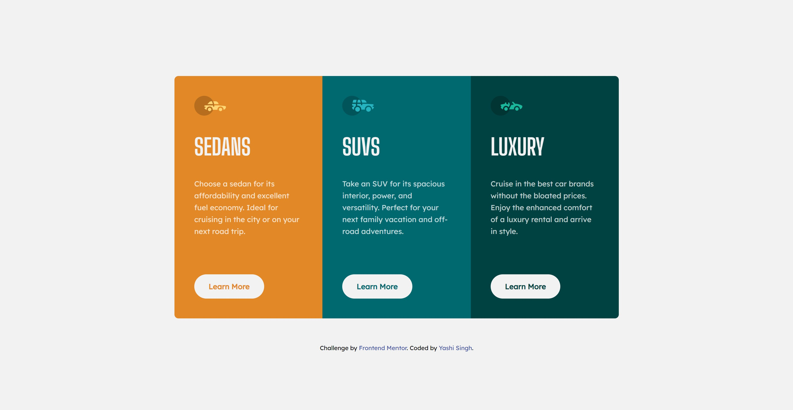

# 3 Column Preview Card Component Frontend Mentor Solution

This is a solution to the [3-column preview card component challenge on Frontend Mentor](https://www.frontendmentor.io/challenges/3column-preview-card-component-pH92eAR2-). Frontend Mentor challenges help you improve your coding skills by building realistic projects.

 

## Table of contents

- [Overview](#overview)
  - [The challenge](#the-challenge)
  - [Screenshot](#screenshot)
  - [Links](#links)
- [My process](#my-process)
  - [Built with](#built-with)
  - [What I learned](#what-i-learned)
  - [Continued development](#continued-development)
  - [Useful resources](#useful-resources)
- [Style Guide](#style-guide)
- [Author](#author)
- [Acknowledgments](#acknowledgments)

## Overview

### The challenge

Users should be able to:

- View the optimal layout depending on their device's screen size
- See hover states for interactive elements

### Screenshot

#### Desktop Design: 

#### Mobile Design

### Links

- [Live Site URL](https://3-column-preview-card-component-yashi.netlify.app)

## My process

### Built with

- Semantic HTML5 markup
- CSS custom properties
- CSS Grid
- Mobile-first workflow

### What I learned

During this project, I reinforced my understanding of CSS Grid to create a responsive layout.

### Continued development

In future projects, I would like to explore more advanced responsive design techniques and animations. Additionally, I want to experiment more with CSS Grid to understand its full potential.

### Useful resources

- [CSS Grid Guide by MDN](https://developer.mozilla.org/en-US/docs/Web/CSS/CSS_Grid_Layout) - This guide helped me understand how to create responsive layouts with CSS Grid.
- [CSS Tricks: A Complete Guide to Grid](https://css-tricks.com/snippets/css/complete-guide-grid/) - This resource was invaluable in refining my understanding of CSS Grid.

## Style Guide

For the Styles refer to [Style Guide](style-guide.md). 

## Author

- LinkedIn - [Yashi Singh](https://www.linkedin.com/in/yashi-singh-b4143a246)
- Frontend Mentor - [@Yashi-Singh-9](https://www.frontendmentor.io/profile/Yashi-Singh-9)

## Acknowledgments

I would like to thank Frontend Mentor for providing such practical challenges. These projects are great for honing my frontend skills and learning new techniques.
