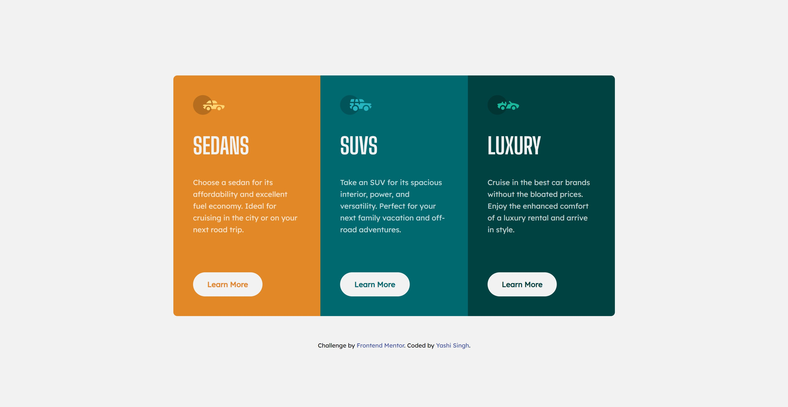

# 3 Column Preview Card Component - Frontend Mentor Solution

[](https://github.com/Yashi-Singh-9/3-Column-Preview-Card-Component/commits/main)  
[](https://github.com/Yashi-Singh-9/3-Column-Preview-Card-Component)  
[](https://www.frontendmentor.io/challenges/3column-preview-card-component-pH92eAR2-)

## Table of Contents

- [Overview](#overview)
  - [The Challenge](#the-challenge)
  - [Screenshots](#screenshots)
  - [Links](#links)
- [Process](#process)
  - [Built With](#built-with)
  - [What I Learned](#what-i-learned)
  - [Continued Development](#continued-development)
  - [Useful Resources](#useful-resources)
- [Installation and Running](#installation-and-running)
- [Style Guide](#style-guide)
- [Author](#author)
- [Acknowledgments](#acknowledgments)

## Overview

### The Challenge

Users should be able to:

- View the optimal layout depending on their device's screen size.
- See hover states for interactive elements.

### Screenshots

#### Desktop Design:


#### Mobile Design:


### Links

- [Solution URL](https://www.frontendmentor.io/solutions/3-column-preview-card-component-tAafMKmHu9)
- [Live Site URL](https://yashi-singh-9.github.io/3-Column-Preview-Card-Component/)

## Process

### Built With

- Semantic HTML5 markup
- SCSS (Sassy CSS)
- CSS Grid for layout
- Mobile-first workflow

### What I Learned

This project deepened my understanding of:

- Using SCSS to modularize and manage styles effectively.
- Leveraging CSS Grid for responsive designs.
- Creating hover states and transitions for improved user interactivity.

### Continued Development

Moving forward, I aim to:

- Explore more advanced features of SCSS, such as mixins and functions.
- Experiment with animations and transitions to enhance UI/UX.
- Implement accessibility standards to ensure usability for all users.

### Useful Resources

- [MDN: CSS Grid Guide](https://developer.mozilla.org/en-US/docs/Web/CSS/CSS_Grid_Layout) - Comprehensive CSS Grid documentation.
- [CSS-Tricks: A Complete Guide to Grid](https://css-tricks.com/snippets/css/complete-guide-grid/) - Great for practical CSS Grid tips.
- [Sass Documentation](https://sass-lang.com/documentation) - Essential guide for working with SCSS.

## Installation and Running

### Prerequisites

- Ensure you have Node.js and npm installed on your system.
- Install the `sass` package globally using npm:
  ```bash
  npm install -g sass
  ```

### Steps

1. Clone the repository:
   ```bash
   git clone https://github.com/Yashi-Singh-9/3-Column-Preview-Card-Component.git
   ```

2. Navigate to the project directory:
   ```bash
   cd 3-Column-Preview-Card-Component
   ```

3. Compile SCSS to CSS:
   ```bash
   sass styles.scss:styles.css --watch
   ```
   This will compile the SCSS file (`styles.scss`) into a CSS file (`styles.css`) and watch for changes.

4. Open the `index.html` file in your browser to view the project.

## Style Guide

For details on design specifications such as colors, fonts, and spacing, refer to the [Style Guide](style-guide.md).

## Author

- **LinkedIn**: [Yashi Singh](https://www.linkedin.com/in/yashi-singh-b4143a246)
- **Frontend Mentor**: [Yashi-Singh-9](https://www.frontendmentor.io/profile/Yashi-Singh-9)
- **GitHub**: [Yashi-Singh-9](https://github.com/Yashi-Singh-9)

## Acknowledgments

A huge thanks to [Frontend Mentor](https://www.frontendmentor.io) for providing this challenge and helping developers like me build real-world projects. These challenges are a fantastic way to practice and improve coding skills.
